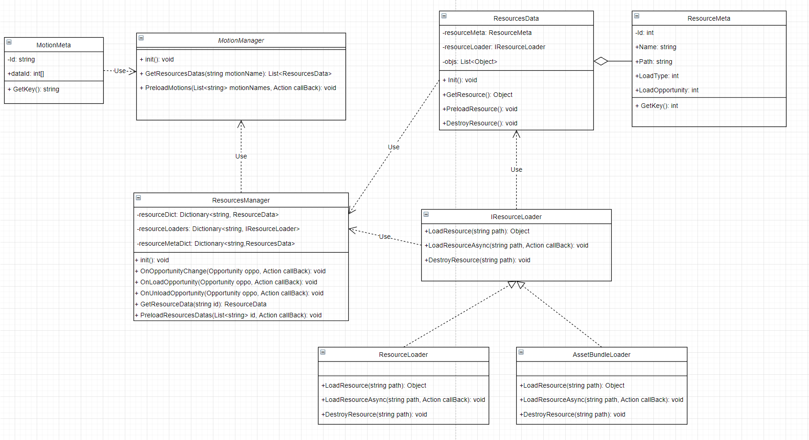

**框架结构**

ResourceMeta是资源表的解析类，定义了资源的ID、名称、加载类型、加载时机等。

MotionMeta是时机表的解析类，定义了某些时机需要加载的资源。

ResourceLoader和AssetBundleLoader都实现了IResourceLoader接口，分别用来加载、释放Resources资源和AssetBundle资源。

ResourcesData类中存储一个ResourceMeta信息和一个加载器，使用加载器加载资源并保存到objs列表中。

ResourcesManager存储了加载好的资源、一个用于分配加载器的字典以及从资源配置表中读取到的所有meta信息。在资源加载时，根据资源类型分配不同的加载器。在程序运行时，可以在不同的时机调用OnOpportunityChange方法来预加载一些必要的资源。

MotionManager类提供了一些外部接口，GetResourcesDatas方法会根绝时机的名称搜索需要用到的资源的ID，再调用ResourcesLoader进行加载。PreloadMotions会在程序加载、程序运行阶段改变时预加载一些特定的资源。

